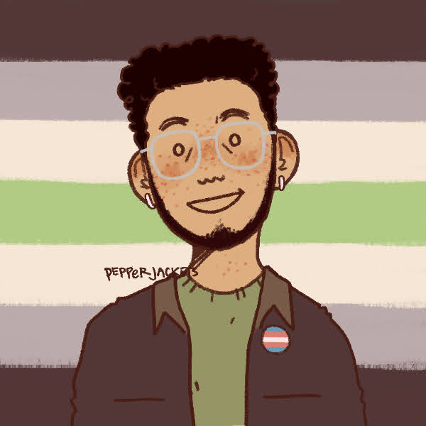

This icon is created from [☆ friend maker ★ by Rowan (pepperjackets)](https://picrew.me/image_maker/1322863) via Picrew.

## My pronouns are *they/them/theirs*

* *He/him/his* is also okay for me in some cases, but I highly prefer *they/them/theirs*
* See how *they/them/theirs* is [used in sentences](./my-pronouns.md)

## What I do

* Five years of professional work in data, including:
    * Three years (and counting) of data engineering
    * Two years of data gathering and verification right out of university
* Academic background in social sciences
    * Unrelated to my current work, but I'm still proud of it because it shows how flexible careers can be for those who keep an open mind
* Hobbies
    * Free or low-cost exercise
    * Photography
    * Photo and video editing (posters, slideshows, informational visuals, memes, etc.)

## What I believe in

* Diversity, equity, and inclusion (Try some [concrete actions towards DE&I](./dei-quick-guide.md) now!)
* Intersectional and interdisciplinary approaches to things
* Accessibility of information and opportunities
* AI and human literacy with ethics in mind
* Authenticity, transparency, and good communication

## Where I am

* Somewhere in Asia with a time zone of [UTC+8](https://www.timeanddate.com/worldclock/timezone/utc8)
* Relatively progressive economy and society where LGBTQIA+ individuals are well-integrated
* However, the state and the laws are too slow to adapt to our reality because we are not recognized as we are

## Where I want to be

* Working towards settling permanently in Canada
* I live, work, and do my societal obligations best as *I am*, not what the state *thinks I should be*

## Links

I'm not quite active on social media for privacy reasons, but if we get along we can chat whenever we can or work on things together!

I go by **@jamiegcan** on these platforms:

* [LinkedIn](https://linkedin.com/in/jamiegcan)
* [GitHub](https://github.com/jamiegcan)
* [Discord](https://discord.com)
* [Telegram](https://t.me/jamiegcan)
